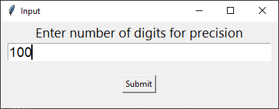
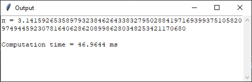
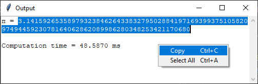

# π to arbitrary precision
Python implementations of numerical methods for calculating the digits of π to an arbitrary precision.


Includes a GUI dialog box to enter the input precision. 
<p align="center" width="100%">
  
</p>
<br>  
The output is displayed in scrollable text box that can be highlighted and copied.<br>
<br>
<p align="center" width="100%">
  
</p>
<p align="center" width="100%">
  
</p>
<br>

## Table of Contents
- [Prerequisites](#prerequisites-heading)
- [Dependencies](#dependencies-heading)
- [Usage](#usage-heading)
- [Chudnovsky Algorithm](#chudnovsky-algorithm-heading)
- [Bailey–Borwein–Plouffe (BBP) Formula ](#bbp-formula-heading)
- [Machin Formula ](#machin-formula-heading)


<a name="prerequisites-heading"></a>
## Prerequisites
Python 3 (tested in version 3.12.2)

<a name="prerequisites-heading"></a>
## Dependencies
There are no external dependencies needed for these routines. They only use built-in Python modules and packages, such as the [tkinter](https://docs.python.org/3/library/tkinter.html) package and the [decimal](https://docs.python.org/3/library/decimal.html) module.  


<a name="usage-heading"></a>
## Usage
### pi_chudnovsky.py
A direct Python implementation of the Chudnovsky Algorithm to calculate π to an arbitrary precision. It can be ran directly in the console with  
```console
python pi_chudnovsky.py
```

### pi_chudnovsky_binary_splitting.py
A more efficient Python implementation of the Chudnovsky algorithm optimized with *binary splitting* that can calculate π to an arbitrary precision. 
It can be ran directly in the console with  
```console
python pi_chudnovsky_binary_splitting.py
```

### pi_bbp.py
A Python implementation of the Bailey-Borwein-Plouffe (BBP) formula to calculate π to an arbitrary precision.
It can be ran directly in the console with  
```console
python pi_bbp.py
```

### pi_machin.py
A Python implementation of the Machin formula to calculate π to an arbitrary precision.
It can be ran directly in the console with  
```console
python pi_machin.py
```

<a name="chudnovsky-algorithm-heading"></a>
## Chudnovsky Algorithm

The Chudnovsky algorithm is a fast method for calculating the digits of π, based on Ramanujan's π formulae. It was published by the Chudnovsky brothers in 1988 and is known for its efficiency in computing π to a high number of decimal 
places. 

```math
\frac{1}{π} = 12\sum_{k=0}^\infty \frac{(-1)^k(6k)!(545140134k + 13591409)}{(3k)!(k!)^3(640320)^{3k + 3/2}}
```

`pi_chudnovsky.py` is a direct Python implementation of the Chudnovsky Algorithm to calculate π to an arbitrary precision. It includes a GUI dialog box to enter the input precision. 
The output is displayed in scrollable text box that can be highlighted and copied.  

`pi_chudnovsky_binary_splitting.py` is a more efficient Python implementation of the Chudnovsky algorithm optimized with binary splitting that can calculate π to an arbitrary precision. 
[Binary splitting](https://en.wikipedia.org/wiki/Binary_splitting) is a general technique for speeding up the computation of series with rational terms. It converts the sum of the individual fractions into one large fraction so that you only need to do ***one*** divide at the end of the calculation, which speeds things up because division is slow compared to multiplication.

More details on the Chudnovsky Algorithm can be found on [Wikipedia](https://en.wikipedia.org/wiki/Chudnovsky_algorithm).

<a name="bbp-formula-heading"></a>
## Bailey–Borwein–Plouffe (BBP) Formula

The Bailey-Borwein-Plouffe (BBP) is a formula for calculating π discovered in 1995 by Simon Plouffe. It is named after the authors of the article in which it was published, David H. Bailey, Peter Borwein, and Plouffe.

```math
π = \sum_{k=0}^\infty \left[ \frac{1}{16^k} \left( \frac{4}{8k+1} - \frac{2}{8k+4} - \frac{1}{8k+5} - \frac{1}{8k+6} \right) \right]
```

`pi_bbp.py` is a Python implementation of the BBP formula to calculate π to an arbitrary precision. It includes a GUI dialog box to enter the input precision. 
The output is displayed in scrollable text box that can be highlighted and copied.  

More details on the BBP formula can be found on [Wikipedia](https://en.wikipedia.org/wiki/Bailey%E2%80%93Borwein%E2%80%93Plouffe_formula).


<a name="machin-formula-heading"></a>
## Machin Formula

Machin's formula discovered by John Machin in 1706 is a method to calculate π using the arctangent function. 

```math
π = 16arctan \left( \frac{1}{5} \right) - 4*arctan \left( \frac{1}{239} \right)
```

`pi_machin.py` is a Python implementation of the Machin formula to calculate π to an arbitrary precision. It includes a GUI dialog box to enter the input precision. 
The output is displayed in scrollable text box that can be highlighted and copied.  

More details on Machin's formula can be found on [Wikipedia](https://en.wikipedia.org/wiki/Machin-like_formula).


